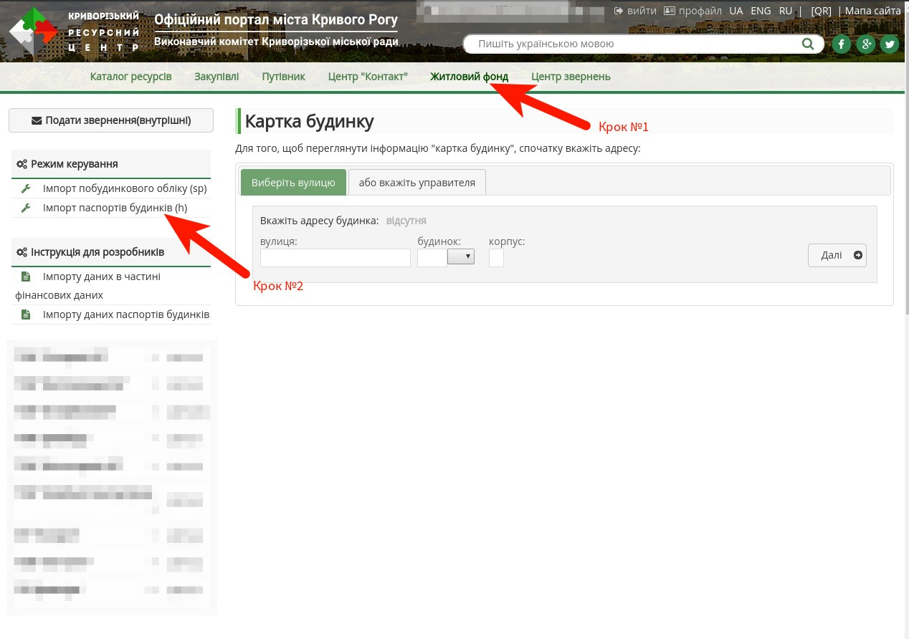
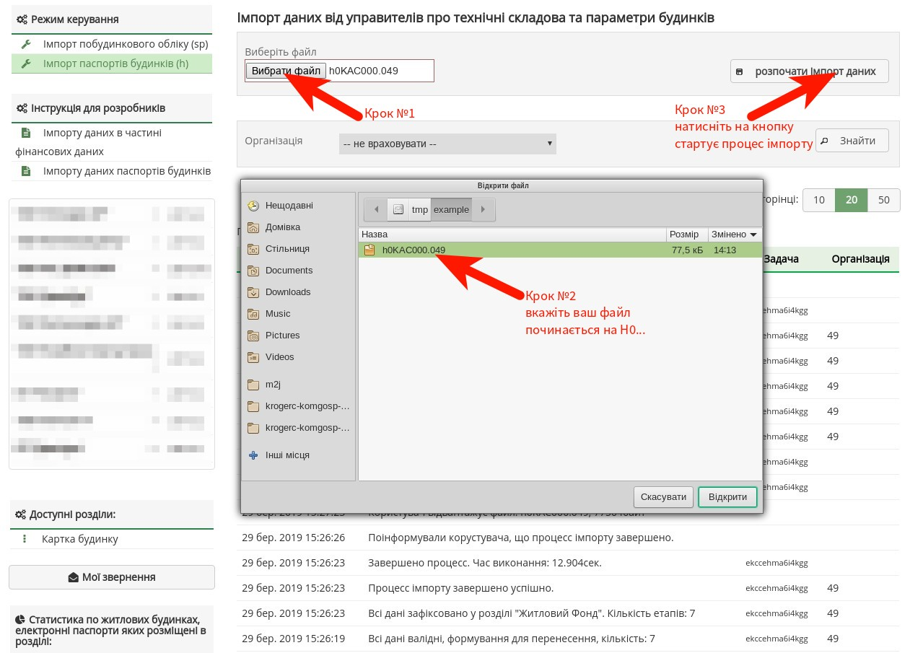
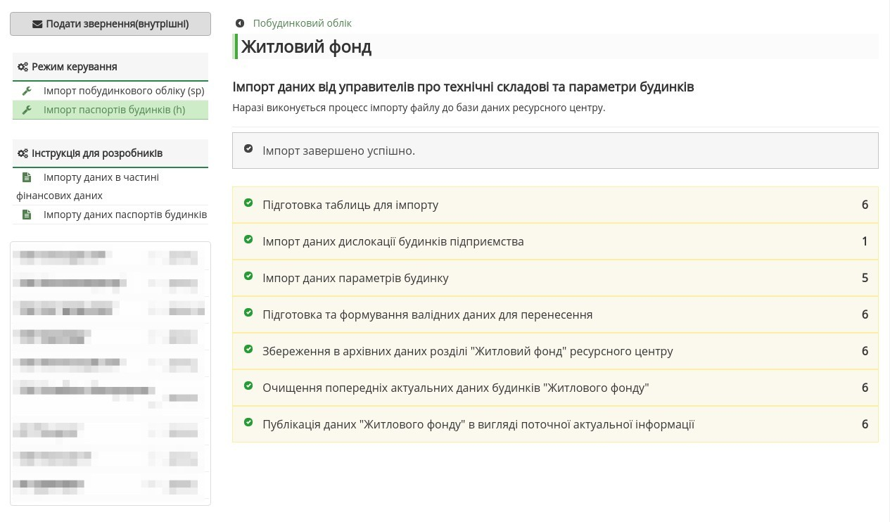

Процес імпорту в загальному вигляді полягає в тому, що представник управителя повинен зайти на сайт ресурсного центру, та у розділі "Житловий фонд" відвантажив файл.
[TOC]

## Етап 1 та 2 (увійти на ресурсний центр)
[Зайти на сайт](https://krmisto.gov.ua/ua/site/login.html) під своїм логіном. Логін видають модератори Криворізького ресурсного центру.
 Посилання: [https://krmisto.gov.ua/ua/site/login.html](https://krmisto.gov.ua/ua/site/login.html)

- - -

## Етап 3 (перейти до форму відвантаження файлу)
Перейти до сторінки "Імпорт паспортів будинків (h)"
 Посилання: [https://krmisto.gov.ua/ua/komgosp/manage/h_files.html](https://krmisto.gov.ua/ua/komgosp/manage/h_files.html)

- - -

## Етап 4 (виконати імпорт файлу)
У формі вкажіть файл для імпорту та розпочніть процес імпорту - кнопка "розпочати імпорт даних"

- - -

## Етап 5 (стан виконання імпорту)
Процес імпорту може займати від декількох секунд до декілької хвилин. Тому поетапно буде висвітлено інформацію, яка завантажується із файлу. У випадку коли процес виявить помилку, то імпорт зупиниться і буде опубліковано повідомлення про помилку (червоним кольором).

- - -
